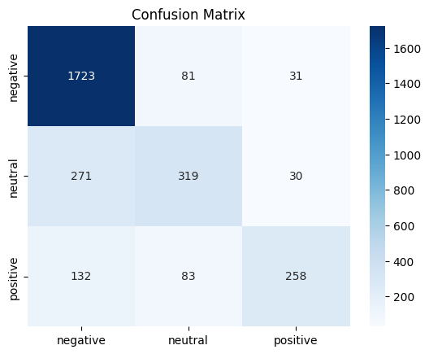

# ✈️ Twitter Airline Sentiment Analysis

A machine learning project that classifies airline-related tweets into **positive**, **neutral**, or **negative** sentiments.  
Built with **Python, Scikit-learn, and Streamlit**.

---

## 🚀 Features
- Preprocessed tweets using NLP techniques (tokenization, stopword removal, TF-IDF).
- Trained ML model for sentiment classification.
- Interactive **Streamlit web app** for real-time sentiment analysis.
- Dataset: Twitter US Airline Sentiment dataset.

## 📁 Project Structure

```bash
sentiment-analysis/
│
├── data/
│   └── tweets.csv          # dataset from Kaggle
├── notebooks/
│   └── sentiment_analysis.ipynb
├── models/
│   └── model.pkl
├── app.py                  # Streamlit app
├── requirements.txt
├── README.md
└── report.pdf

```
## ⚡ Installation & Usage

1. Clone the repository:
   ```bash
   git clone https://github.com/Sharruk/sentiment-analysis.git
   cd sentiment-analysis


2. Create a virtual environment and install dependencies:

python3 -m venv venv
source venv/bin/activate    # On Linux/Mac
venv\Scripts\activate       # On Windows
pip install -r requirements.txt

3. Run the Streamlit app:

streamlit run app.py


## 📊 Model Performance

We trained a **Logistic Regression classifier** on the Twitter Airline Sentiment dataset.  
The model was evaluated using **precision, recall, F1-score, and accuracy**.

### 🔹 Classification Report

| Sentiment  | Precision | Recall | F1-Score | Support |
|------------|-----------|--------|----------|---------|
| Negative   | **0.81**  | **0.94** | **0.87** | 1835    |
| Neutral    | 0.66      | 0.51   | 0.58     | 620     |
| Positive   | 0.81      | 0.55   | 0.65     | 473     |
| **Accuracy** |         |        | **0.79** | 2928    |
| **Macro Avg** | 0.76   | 0.67   | 0.70     | 2928    |
| **Weighted Avg** | 0.78 | 0.79   | 0.77     | 2928    |

---

### 🔹 Confusion Matrix

The confusion matrix below shows the distribution of predicted vs. actual classes:

- The model performs **very well on negative tweets** (high recall: 0.94).
- Performance is **moderate on positive tweets** (recall: 0.55).
- The **neutral class is hardest to predict** (recall: 0.51), which is common in sentiment analysis since neutral tweets often overlap with positive/negative wording.

<p align="center">
  
</p>

---

### 🔹 Key Insights
- **Overall Accuracy:** ~79%  
- **Strengths:** Captures negative sentiments very accurately.  
- **Weaknesses:** Neutral class needs improvement (possibly more data, advanced NLP models like BERT).  
- **Next Steps:** Experiment with deep learning models (LSTMs, Transformers) to improve positive/neutral detection.  


